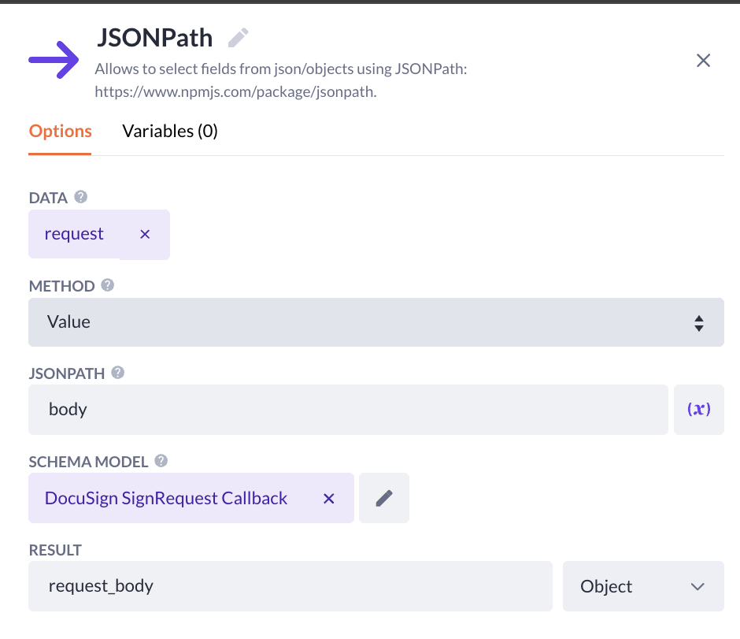

# DocuSign - Create Sign Request

Create a sign request for one or more signers. This request (for each of the signers) will be stored in an `Envelope`.
This step returns the `UUID` of the envelope that is created.

## Prerequisites

- You have obtained an `Access Token` with [DocuSign - Get Access Token](../docusign-get-access-token/readme.md).
- You have created the necessary models in [DocuSign > Application Configuration > Data Models](../../readme.md#application-configuration#data-models)
- You have uploaded a document to the `Document` model

## How to use

### Template Documents

If you followed the instructions for [Application Configuration](../../readme.md#application-configuration), you should have a `Document` model.

If not, please ensure that your application includes a model capable of storing `.docx` or `.pdf` files.

DocuSign provides a feature that supports automatic placement of anchors within your documents.

This block enables the following anchors:

- `$signHere<n>`
- `$firstName<n>`
- `$lastName<n>`
- `$fullName<n>`
- `$emailAddress<n>`
- `$companyName<n>`
- `$dateSigned<n>`

> [!NOTE]
> The `<n>` placeholder represents the signer's routing order as defined in your request.
>
> If no routing order is provided, the order in which signers appear in the collection will be used by default.
>
> Example: `$signHere1` will placed a `Sign Here Anchor` on the page for the signer to place there signature.

> [!IMPORTANT]
> After you have placed the variables in your document, make sure to set the variables `Font Color` to white so that they are invisible

#### Test document

Find it [here](../../templates/docusign_template.docx)

### Action (example)

> [!NOTE]
> There's multiple ways to setup your Sign Request flow.
>
> This is a basic example of how to use the step.

1. Open the `Settings` of the action.

2. Navigate to the `Security` tab.

3. Toggle `PRIVATE ACTION`.

4. Select the appropriate `Authentication Profile`.

5. Configure the action for each of your roles.

6. Click `Save` and close the `Settings`.

7. Click on the `Start`-step.

8. Navigate to `Action Variables`.

9. Add a new `Object` variable and name it `document`.

10. Fetch the desired template document you have uploaded.

11. Insert a `Condition` step.

12. Click on the `Condition` and navigate to `Variables`.

13. Create a new `Object` variable named `docusign_token`.

14. Configure the filter to fetch the record that belongs to the `current_webuser`, click `Apply`, and `Save`.

15. Configure the first path of the condition:

    ```text
    docusign_tokens exists AND
    docusign_token.access_token exists
    ```

16. Insert a [Sub Action](https://my.bettyblocks.com/block-store/a390d91f-f284-4134-b854-38312e8297ff).

17. Configure the sub action to run `[DS] Refresh Access Token` which you have setup in [Docusign - Refresh Access Token > How to use > Actio Setup]

> [!TIP]
> Using a `Sub Action` speeds up your development process because you don't have to reconfigure certain options/steps each time.

18. If you've configured `[DS] Refresh Access Token` correctly, it should allow you to fill in the `RESULT AS` option. Name it `access_token`.

19. Insert the `DocuSign - Create Sign Request` step.

20. Configure the options and press `Save`:

| Option                         | Value                                    |
| ------------------------------ | ---------------------------------------- |
| BASE URL                       | `Configurations > DocuSign > Base URL`   |
| ACCOUNT ID                     | `Conifugrations > DocuSign > Account ID` |
| DOCUMENT TO BE SIGNED          | `docusign_document.file`                 |
| Signer COLLECTION              | `signers`                                |
| FIRST NAME PROPERTY (OPTIONAL) | `first_name`                             |
| LAST NAME PROPERTY (OPTIONAL)  | `last_name`                              |
| FULL NAME PROPERTY             | `full_name`                              |
| EMAIL ADDRESS PROPERTY         | `email_address`                          |
| CALLBACK URL                   | [Read more](./readme.md#callback_url)    |
| ACCESS TOKEN                   | `access_token`                           |
| ENVELOPE UUID                  | envelope_uuid                            |

21. Insert a `Create Record` step.

22. Configure the `Model` to `Envelope`.

23. Store the resulting `envelope_uuid` on the appropriate property.

### Callback URL

If you want to receive update's on when the user has signed the document, you must provide a callback URL.

#### Setting up a Callback Endpoint

##### Prerequisites

- [Endpoint Utility Functions](https://my.bettyblocks.com/block-store/01022068-32f9-4e71-983f-ea3dc365d013)
- [JSONPath](https://my.bettyblocks.com/block-store/4a8a0dac-724d-4034-833e-b16053ebcbdf)

> [!NOTE]
> This is a very basic implementation of an API endpoint.
> Securing the endpoint and parsing the request can be done however you like.
>
> Also, it might take a while for DocuSign to send the request after the request is completed

1. Create a new action and name it `[API][DS] Sign Request Callback`

2. Click the `Start`-step.

3. Add a new `Input Variable` named `request` and make it `Text`.

4. Add a new `Action Variable` named `body` and make it `Text`.

5. Add a new `Action Variable` named `status`, make it a `Number` and set the default value to `200`.

6. Parse the request however you like with `JSONPath`.

> [!TIP]
> Check this [example JSON](./callback_response_example.json) for each available key in the callback request
>
> Create a `Schema Model` with the desired properties and assign this Schema Model in the JSONPath
> 

7. Insert `Format Endpoint Result` at the end of your step.

8. Configure `BODY` to the action variable `body` and the `STATUS CODE` to the action variable `status`.

9. Define `RESULT` as `result`.

10. Select the `Finish`-step and choose `result` as the `OUTPUT VARIABLE`
