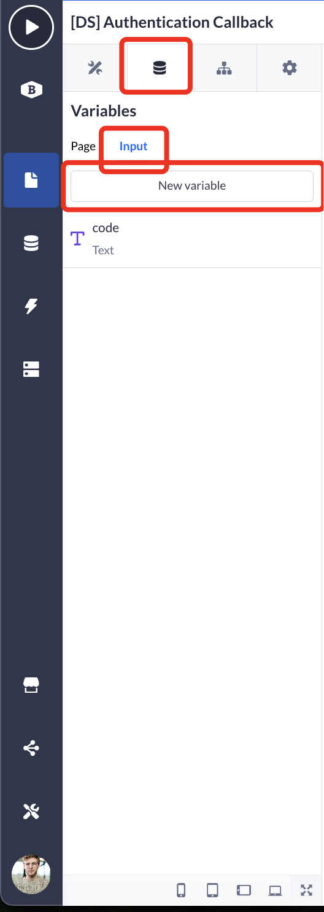
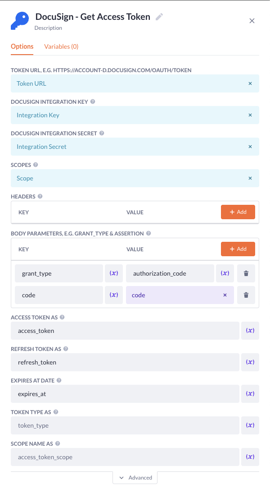
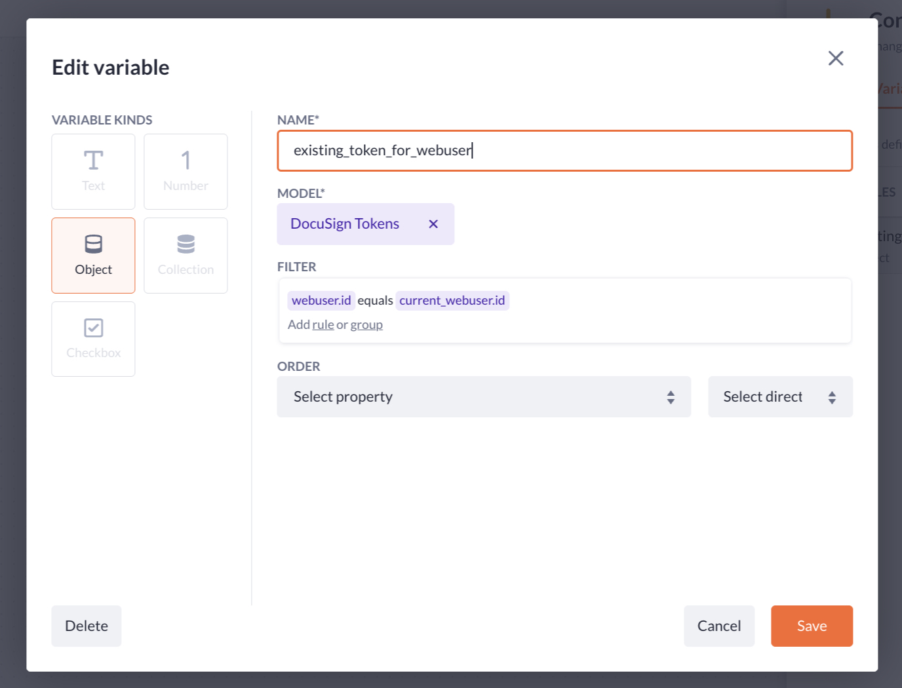

# DocuSign - Get Access Toke

Used to get an access token for the DocuSign API from the DocuSign Callback.

## Prerequisites

- You have configured you DocuSign configuration.
- You have created the necessary data models and configured permissions
- You have obtained an access code from DocuSign.

## Optional

- [Raise Error Block](https://my.bettyblocks.com/block-store/ed82e4de-9248-4bb7-8791-d2cad09369b2)

> [!NOTE]
> To obtain an access code, please follow the instructions for implementing [docusign-get-authentication-url](../../docusign-get-authentication-url/readme.md)

## How to use

### 1. Page Setup

Summary: Setting up a callback page to extract the access code and submit it in the form.

1. Create a new page in the Page Builder.

2. Name the page: `[DS] Authentication Callback`

3. Create a new `TEXT` input variable for the page named `code`:
   

   > [!NOTE]
   > This variable will be filled when the user is redirected back to our application.

4. Insert a form on the page and name it `Callback Form`.

5. Toggle `MODEL BASED FORM` OFF.

6. Insert `Handle Callback` into the `ACTION NAME` field.

7. Delete all the elements from the form, except the `Alert`.

8. Insert a hidden input.

9. Configure the hidden input as `Non-property-based` and click `Save`.

> [!NOTE]
> Leave the `ACTION INPUT VARIABLE (NUMBER)` field empty. We will create a `text` property in the next step.

10. Select the hidden input and press the `Select action input variable`-button.

11. In the picker, choose the `+`-icon to create a new variable.

12. Create a `Text`-variable and name it `code`.

13. Configure the interactions on the form:
    

### 2. Action Setup

Summary: Setup the action to validate the code and use it to gain an access token.

![Action: [DS] Authentication Callback - Handle callback](../../public/ds_authentication_callback_handle_callback.jpg)

1. Navigate to the action by opening it on the form or search in your actions for:
   `[DS] Authentication Callback - Handle Callback`

2. Open the settings of the action.

3. Navigate to `Permissions`.

4. Set `PRIVATE ACTION` to `true`.

5. Configure the `AUTHENTICATION PROFILE` to the correct profile (usually `Webuser`).

6. Configure the permissions for each role.

7. Insert a condition to validate if the code exists (required).

> [!NOTE]
> If the code does not exist, you can use the Raise Error step to give the user information about what went wrong. (optional)

8. Insert the step `DocuSign - Get Access Token`.

9. Configure the step and press Save:

| Option                       | Value                                                         |
| ---------------------------- | ------------------------------------------------------------- |
| TOKEN URL                    | `DocuSign Configuration > Token URL`                          |
| DOCUYSIGN INTEGRATION KEY    | `DocuSign Configuration > Integration Key`                    |
| DOCUSIGN INTEGRATION SECRET  | `DocuSign Configuration > Integration Secret`                 |
| SCOPES                       | `DocuSign Configuration > Scopes`                             |
| HEADERS                      | Allows you to specify additional headers if needed (optional) |
| BODY PARAMETERS - grant_type | authorization_code                                            |
| BODY PARAMETERS - code       | `code` (action input)                                         |
| ACCESS TOKESN AS             | access_token                                                  |
| REFRESH TOKEN AS             | refresh_token                                                 |
| EXPIRES AT AS                | expires_at                                                    |

> [!NOTE]
> You can optionally configure the `TOKEN TYPE AS` and `SCOPE NAME AS` if you want to store these values.

10. Insert a condition after the previous step.

11. Open the condition and create a new `Object` variable.

12. Name it `existing_token_for_webuser`.

13. Configure the model to `DocuSign Tokens`.

14. Configure the filter where `webuser.id equals current_webuser.id` and hit save:
    

15. Press `Paths` if you are not already navigated to the condition's paths

16. Configure the first path to check if the object `existing_token_for_webuser` exists.

17. In the first path, add an `Update Record` step.

18. Set the `RECORD` for this step to `existing_token_for_webuser`.

19. Configure the `VALUE MAPPING` to store the new variables (not limited to): `access_token`, `refresh_token`, and `expires_at`

20. Click save.

21. In the `Else` path of your condition, add a `Create Record` step.

22. Configure the `MODEL` to `DocuSign Tokens`.

23. Configure the `VALUE MAPPING` to store the variables (not limited to): `access_token`, `refresh_tokens`, and `expires_at`

24. Click save.
