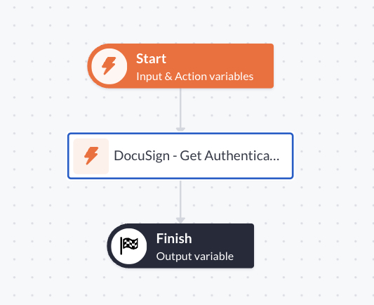

# DocuSign - Get Authentication URL

Used to generate an authentication URL based on the provided options.

## Prerequisites

- You have configured you [Application Configuration](../../readme.md#application-configuration).

## Options

| Name                     | Description                                                                                                                                              |
| :----------------------- | :------------------------------------------------------------------------------------------------------------------------------------------------------- |
| Authentication method    | The authentication strategy to use ([Learn more](https://developers.docusign.com/platform/auth/))                                                        |
| Authorization Url        | The DocuSign Authorization URL configuration ([Learn more](https://developers.docusign.com/platform/auth/confidential-authcode-get-token/))              |
| Scope                    | The authentication scope ([Learn more](https://developers.docusign.com/platform/auth/reference/scopes/))                                                 |
| Integration Key          | Your Integration Key can be found in your Developer Dashboard at Docusign: https://apps-d.docusign.com/admin/apps-and-keys                               |
| Redirect URI             | The redirect URL which you have specified for your application in DocuSign: https://apps-d.docusign.com/admin/apps-and-keys                              |
| State                    | An optional state value that you can use to prevent CSRF and replay attacks (See more: https://auth0.com/docs/secure/attack-protection/state-parameters) |
| Login Hint               | An optional login_hint that enables you to prepopulate the email address field on the sign-in screen.                                                    |
| Result                   | The authentication URL to redirect the user to                                                                                                           |
| Debug Logging (advanced) | Turn on debug logging                                                                                                                                    |

## How to use

### Page Setup (Example)

Summary: Provides an example setup of how to use this step and redirect the user to the resulting URL.

1. Create a new page or use an existing one.

> [!IMPORTANT]
> It is required that the page is protected with an `Authentication Profile`.

2. Insert an `Action Button` in the desired location.

> [!NOTE]
> You can also use a form but you generally need no user input for this action.

3. Select the newly created `Action Button`.

4. Give the action button an appropriate label. Example: `Login to DocuSign`.

5. Configure the button's interaction:

```text
OnActionSuccess > navigateToOutputUrl
```

### Action Setup

Summary: Use this step to return the authentication URL to the user.



1. Open the `Settings` of the action.

2. Give the action an appropriate name. Example: `{{PAGE_NAME_PREFIX}} - Login to Docusign`.

> [!NOTE]
> It is generally a good practice to include the name of the page where this button is used.
> This helps you organize so that you are able to find your actions faster.

3. Click `Save`.

4. Open the `Permissions`-tab.

5. Toggle `PRIVATE ACTION` on.

6. Select your `Authentication Profile`.

7. Configure the permissions for each of your roles.

8. Click `Save` and close the `Setings`-panel

9. Insert the step `DocuSign - Get Authentication URL`.

10. Configure the options:

| Option                   | Value                                                                                     |
| ------------------------ | ----------------------------------------------------------------------------------------- |
| AUTHENTICATION METHOD    | Confidential Grant                                                                        |
| AUTHORIZATION URL        | `Configurations > DocuSign > Auth URL`                                                    |
| SCOPES                   | `Configurations > DocuSign > Scopes`                                                      |
| INTEGRATION KEY          | `Configurations > DocuSign > Integration Key`                                             |
| REDIRECT URI             | `Configurations > DocuSign > Redirect URI`                                                |
| STATE                    | (optional): See [Auth0](https://auth0.com/docs/secure/attack-protection/state-parameters) |
| LOGIN HINT               | `current_webuser.email`                                                                   |
| Result                   | `authentication_url`                                                                      |
| Debug Logging (advanced) | Turn on debug logging if you are running into trouble                                     |

11. Click Save.

12. Click on the `Finish`-step.

13. Select `authentication_url` as `OUTPUT VARIABLE`

When you press the button, and the action is successfully executed, you will be redirected to DocuSign's login page.
If you've set the `Login Hint`-option, the email will be prefilled.

> [!NOTE]
> Remember to turn on debug logging if you are running into issues.
