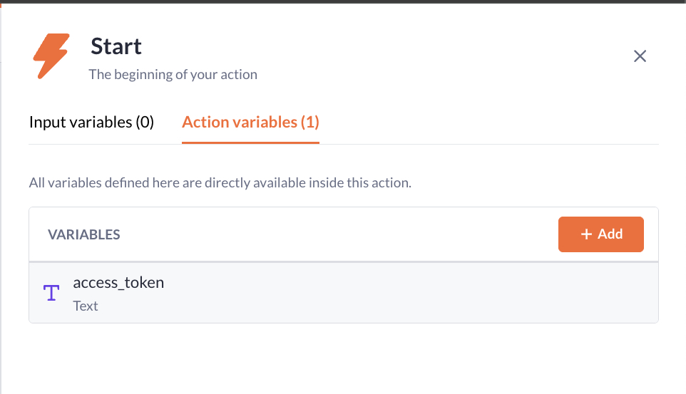
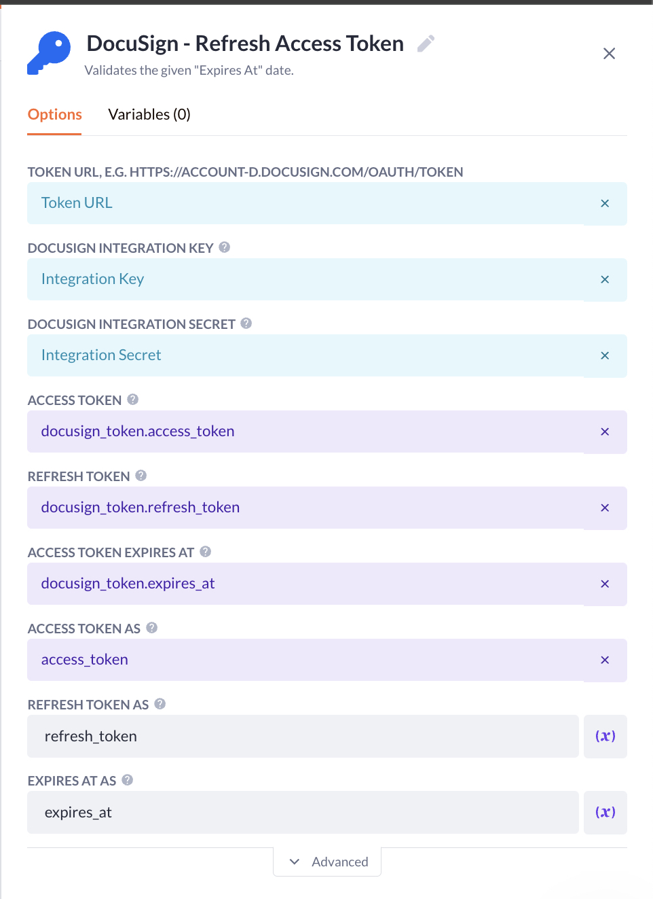

# DocuSign - Refresh Access Token

Used to refresh an access token when it is expired.

> [!IMPORTANT]
> You don't need to manually calculate if the token is valid or not.
> This step already takes care of checking the token for validity with the provided `EXPIRES AT` option.

## Prerequisites

- You have setup your models according to [Setup Datamodels](../../readme.md)
- You have stored the `Access Token`, `Refresh Token`, and `Expires At` with `DocuSign - Get Access Token`

## How to use

Should be used every time you make an API request to DocuSign **after** you have authenticated the user.
For instance, before you use `DocuSign - Create Sign Request` you must use this step to validate the `Access Token`.

### Action Setup

Summary: Fetches the current webuser's docusign tokens.
If they exist, use `DocuSign - Refresh Access Token` to validate the token & refresh if needed.
Then, store the validated token on the webuser's `DocuSign Tokens` record.

![Action: [DS] Refresh Access Token](../../public/ds_refresh_access_token.jpg)

1. Create a new action and name it `[DS] Refresh Access Token`.

2. Open the settings of the action and navigate to `Permissions`.

3. Toggle `PRIVATE ACTION` on.

4. Select the appropriate `Authentication Profile`.

5. Configure permissions for each role.

6. Click `Save` and close the settings panel.

7. Click on the `Start`-step.

8. Add a new `Action Variable`.

9. Set the type to `Text` and name it `access_token`.

   > [!NOTE]
   > We will reassign this variable in the `DocuSign - Refresh Access Token`-step.

   

10. Insert a `Condition` step.

11. Click on the new `Condition` and open the `Variables`.

12. Add a new `Object` variable and name it `docusign_token`..

13. Configure the filter as follows and click save:

    ```text
    where webuser.id equals current_webuser.id
    ```

14. Go to the `Paths` tab of the condition.

15. Check if the variable `docusign_token` exists in the first path.

    > [!NOTE]
    > You can additionally use a `Raise Error` step from the Blockstore to inform your user about the error.

16. Add the step `DocuSign - Refresh Access Token` in the first path.

17. Configure the options and click `Save`:

    | Option                  | Value                                            |
    | ----------------------- | ------------------------------------------------ |
    | TOKEN URL               | `Configurations > DocuSign > Token URL`          |
    | INTEGRATION KEY         | `Configurations > DOcuSign > Integration Key`    |
    | INTEGRATION SECRET      | `Configurations > DocuSign > Integration Secret` |
    | ACCESS TOKEN            | `docusign_token > Access token`                  |
    | REFRESH TOKEN           | `docusign_token > Refresh token`                 |
    | ACCESS TOKEN EXPIRES AT | `docusign_token > Expires at`                    |
    | ACCESS TOKEN AS         | `Action Variables > access_token`                |
    | REFRESH TOKEN AS        | refresh_token                                    |
    | EXPIRES AT AS           | expires_at                                       |

    

18. Insert a `Update Record` step after the `DocuSign - Refresh Access Token`-step.

19. Configure the `RECORD` to `docusign_token` (which you fetched in the condition's variables).

20. Configure the `VALUE MAPPING` and click `Save`:

    | Property      | Value           |
    | ------------- | --------------- |
    | Access Token  | `access_token`  |
    | Refresh Token | `refresh_token` |
    | Expires at    | `expires_at`    |

    > [!NOTE]
    > If you've followed the instructions, you should have only 1 `access_token` variable.

21. Click on the `Finish`-step.

22. Configure the `OUTPUT VARIABLE` to `access_token`.
