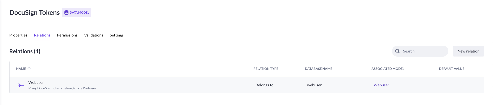
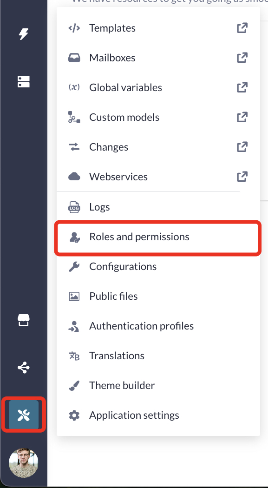

# DocuSign Blocks

<!--toc:start-->

- [DocuSign Blocks](#docusign-blocks)
  - [Functions](#functions)
  - [Prerequisites](#prerequisites)
  - [Application Configuration](#application-configuration) - [Data Model](#data-model) - [Configurations](#configurations)
  <!--toc:end-->

These blocks are used to communicate with the DocuSign API.

## Functions

- [Get Authentication URL](./functions/docusign-get-authentication-url/readme.md): Generates a URL based on the provided options.
- [Get Access Token](./functions/docusign-get-access-token/readme.md): Parse the provided Access code and use it to gain an Access Token.
- [Refresh Access Token](./functions/docusign-refresh-access-token/readme.md): Validate a given access token and refresh it if needed.
- [Create Sign Request](./functions/docusign-create-sign-request/readme.md): Create a sign request for the provided collection signers.

## Prerequisites

- [DocuSign Developer Account](https://developers.docusign.com/)
- [Configured an app in DocuSign Developer Dashboard](https://support.docusign.com/s/document-item?language=en_US&bundleId=pik1583277475390&topicId=pmp1583277397015.html&_LANG=enus)
- (Optional): [Raise Error Block](https://my.bettyblocks.com/block-store/ed82e4de-9248-4bb7-8791-d2cad09369b2)
- (Optional): [Sub Action Block](https://my.bettyblocks.com/block-store/a390d91f-f284-4134-b854-38312e8297ff)

## Application Configuration

> [!IMPORTANT]
> Please make sure to follow the instructions for setting up the **Data Model** and **Roles & Permission**
>
> This documentation makes various references to data models, configurations, etc..

### Data Model

#### WebUser

The `WebUser` model will be required to store the user's DocuSign tokens.

1. Create a new model named `WebUser` if it does not exist yet.

> [!TIP]
> You can use the Page template `User, account login and register` to automatically create the `WebUser` model.

#### DocuSign Tokens

> [!IMPORTANT]
> It is **VERY IMPORTANT** to create a **separate** model for storing DocuSign tokens, rather than saving them directly on the `WebUser`.
>
> This separation enables you to configure `READ` permissions so that **only the `WebUser` who owns the `DocuSign Tokens` record** can access its data.
>
> Doing so significantly reduces the risk of token theft.

1. Create a new model named `DocuSign Tokens`.

2. Use the `Quick Add Properties`-button to add the following properties:

   | Name          | Type               |
   | ------------- | ------------------ |
   | Access Token  | Text (multi line)  |
   | Refresh Token | Text (multi line)  |
   | Expires at    | Text (single line) |

> [!NOTE]
> You can optionally add the `Scopes: text (single line)` property to store the scopes for each user individually.
>
> This setup mainly focusses on using the same scopes for every user.

3. Open the `Relations`-tab for the `DocuSign Tokens`-model.

4. Create a new `Belongs To` relation with the `WebUser` and save.
   

#### Document

Will be used to store the document's to sign.

Having a separate model to store your files is generally a good practice to keep your database structured.
You can optionally add a `List` property to indicate the type of file.

This also enables you to easily link multiple documents to a single record.

1. Create a new model named `Document`.

2. Add a `File` property and name it `File`.

3. Set the file types to `.docx` and `.pdf` and click `Save`.

> [!NOTE]
> These are the file types supported by DocuSign.

### Roles & Permissions

> [!NOTE]
> By default, your application has the roles `admin` and `public`.
>
> Read [Roles and Permissions explained](https://docs.bettyblocks.com/roles-and-permissions-explained) for more information on setting up roles.

1. Click the tools icon on the bottom right and navigate to `Roles & Permissions`:
   

#### DocuSign Tokens (required)

1. Choose on of the roles in your application.

2. Search for `DocuSign Tokens`.

3. Click on the green checkmark in the `READ`-column and choose `Use filter`.

4. Configure the filter and click `Apply` and `Save`:

> [!NOTE]
> Older applications might also include `CREATE`, `UPDATE`, and `DELETE` operations.
>
> If that's the case, make sure to configure `UPDATE` and `DELETE` permissions in the same way as `READ`.
>
> Note that these permissions only apply to B5 operations.

### Configurations

Summary: Create a configuration set in your application to use with the steps.

1. Open you development sandbox.

2. Click on the `Tools`-icon in the bottom-left corner.

3. Click on `Configurations`:
   

4. Click on `New Configuration`.

5. Name it `DocuSign`.

6. Configure the values according to the following table:

| Name                                                                                        | Value                                                           |
| ------------------------------------------------------------------------------------------- | --------------------------------------------------------------- |
| [Account ID](https://apps-d.docusign.com/admin/apps-and-keys)                               | `abcd123-....-....-....`                                        |
| [Scopes](https://developers.docusign.com/platform/auth/reference/scopes/)                   | `signature`                                                     |
| [Base URI](https://developers.docusign.com/platform/api-endpoint-base-paths/)               | `https://demo.docusign.net/`                                    |
| [Redirect URL](https://apps-d.docusign.com/admin/apps-and-keys)                             | `https://{{YOUR_APPLICATION}}.betty.app/docusign/auth/callback` |
| [Auth URL](https://developers.docusign.com/platform/auth/confidential-authcode-get-token/)  | `https://account-d.docusign.com/oauth/auth`                     |
| [Token URL](https://developers.docusign.com/platform/auth/confidential-authcode-get-token/) | `https://account-d.docusign.com/oauth/token`                    |
| [Integration Key](https://apps-d.docusign.com/admin/apps-and-keys)                          | `abcd123-....-....-....`                                        |
| [Integration Secret](https://apps-d.docusign.com/admin/apps-and-keys)                       | `abcd123-....-....-....`                                        |

> [!NOTE]
>
> 1. These are example values and should not be used as is.
> 2. These configurations must be configured correctly when you are going live
>    and DocuSign also requires a [Go-Live Review](https://developers.docusign.com/platform/go-live/)
