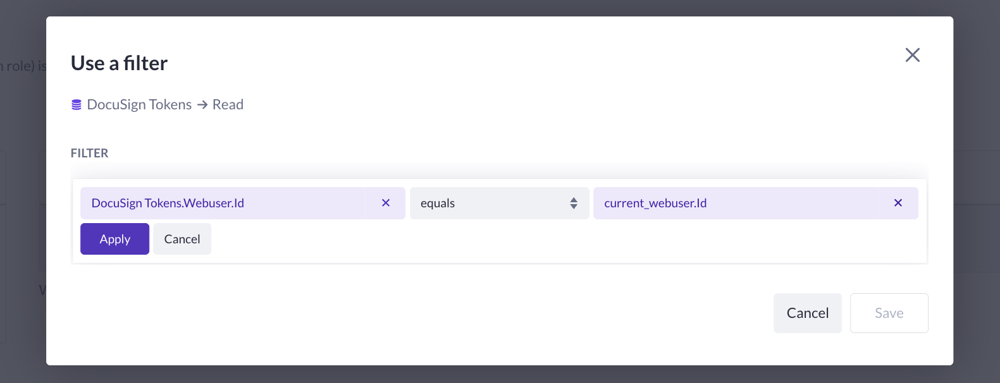

# DocuSign Blocks

## Table of Contents

<!--toc:start-->

- [DocuSign Blocks](#docusign-blocks)
  - [Table of Contents](#table-of-contents)
  - [Functions](#functions)
  - [Getting Started](#getting-started)
    - [Prerequisites](#prerequisites)
    - [Data Model](#data-model)
      - [WebUser](#webuser)
      - [DocuSign Tokens](#docusign-tokens)
      - [Document](#document)
    - [Roles & Permissions](#roles-permissions)
      - [DocuSign Tokens (required)](#docusign-tokens-required)
    - [Configurations](#configurations)

<!--toc:end-->

These blocks are used to communicate with the DocuSign API.

## Functions

- [Get Authentication URL](./functions/docusign-get-authentication-url/readme.md): Generates a URL based on the provided options.
- [Get Access Token](./functions/docusign-get-access-token/readme.md): Parse the provided Access code and use it to gain an Access Token.
- [Refresh Access Token](./functions/docusign-refresh-access-token/readme.md): Validate a given access token and refresh it if needed.
- [Create Sign Request](./functions/docusign-create-sign-request/readme.md): Create a sign request for the provided collection signers.
- [Download Envelope](./functions/docusign-download-envelope/readme.md): Download (signed) documents for an envelope (sign request)

## Getting Started

### Prerequisites

- [DocuSign Developer Account](https://developers.docusign.com/)
- [Configured an app in DocuSign Developer Dashboard](https://support.docusign.com/s/document-item?language=en_US&bundleId=pik1583277475390&topicId=pmp1583277397015.html&_LANG=enus)
- (Optional): [Raise Error Block](https://my.bettyblocks.com/block-store/ed82e4de-9248-4bb7-8791-d2cad09369b2)
- (Optional): [Sub Action Block](https://my.bettyblocks.com/block-store/a390d91f-f284-4134-b854-38312e8297ff)

### Data Model

Please make sure to setup the following data models.
This setup serves as an example starting point to work with the DocuSign steps.

#### WebUser

The `WebUser` model will be required to store the user's DocuSign tokens and needs the following properties:

| PROPERTY | TYPE         |
| -------- | ------------ |
| Email    | Email / Text |
| Password | Password     |

#### DocuSign Tokens

> [!IMPORTANT]
> It is **VERY IMPORTANT** to create a **separate** model for storing DocuSign tokens, rather than saving them directly on the `WebUser`.
>
> This separation enables you to configure `READ` permissions so that **only the `WebUser` who owns the `DocuSign Tokens` record** can access its data.
>
> Doing so significantly reduces the risk of token theft.

| Name          | Type               |
| ------------- | ------------------ |
| Access Token  | Text (multi line)  |
| Refresh Token | Text (multi line)  |
| Expires at    | Text (single line) |
| WebUser       | Belongs To         |

#### Document

Will be used to store the document's to sign.

| PROPERTY | TYPE               |
| -------- | ------------------ |
| File     | File (.docx, .pdf) |
| Type     | List (Envelope)    |

### Roles & Permissions

> [!NOTE]
> By default, your application has the roles `admin` and `public`.
>
> Read [Roles and Permissions explained](https://docs.bettyblocks.com/roles-and-permissions-explained) for more information on setting up roles.

#### DocuSign Tokens (required)

1. Choose one of the roles in your application.

2. Search for `DocuSign Tokens`.

3. Click on the green check mark in the `READ`-column and choose `Use filter`.

4. Configure the filter and click `Apply` and `Save`:

> [!NOTE]
> Older applications might also include `CREATE`, `UPDATE`, and `DELETE` operations.
>
> If that's the case, make sure to configure `UPDATE` and `DELETE` permissions in the same way as `READ`.
>
> Note that these permissions only apply to B5 operations.

### Configurations

Summary: Create a configuration set in your application to use with the steps.

| Name                                                                                        | Value                                                           |
| ------------------------------------------------------------------------------------------- | --------------------------------------------------------------- |
| [Account ID](https://apps-d.docusign.com/admin/apps-and-keys)                               | `abcd123-....-....-....`                                        |
| [Scopes](https://developers.docusign.com/platform/auth/reference/scopes/)                   | `signature`                                                     |
| [Base URI](https://developers.docusign.com/platform/api-endpoint-base-paths/)               | `https://demo.docusign.net/`                                    |
| [Redirect URL](https://apps-d.docusign.com/admin/apps-and-keys)                             | `https://{{YOUR_APPLICATION}}.betty.app/docusign/auth/callback` |
| [Auth URL](https://developers.docusign.com/platform/auth/confidential-authcode-get-token/)  | `https://account-d.docusign.com/oauth/auth`                     |
| [Token URL](https://developers.docusign.com/platform/auth/confidential-authcode-get-token/) | `https://account-d.docusign.com/oauth/token`                    |
| [Integration Key](https://apps-d.docusign.com/admin/apps-and-keys)                          | `abcd123-....-....-....`                                        |
| [Integration Secret](https://apps-d.docusign.com/admin/apps-and-keys)                       | `abcd123-....-....-....`                                        |

> [!NOTE]
>
> 1. These are example values and should not be used as is.
> 2. These configurations must be configured correctly when you are going live
> 3. DocuSign requires a [Go-Live Review](https://developers.docusign.com/platform/go-live/)
